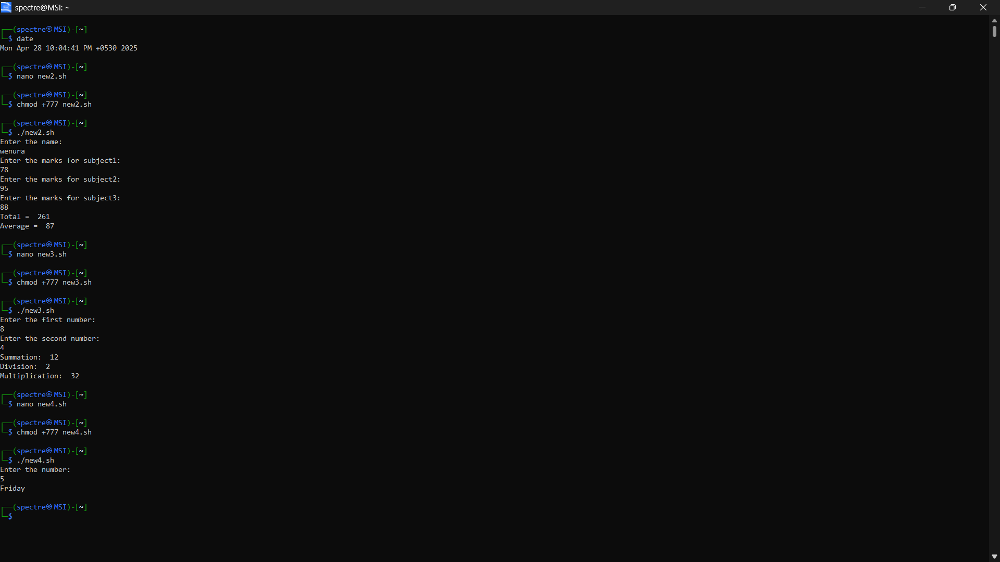
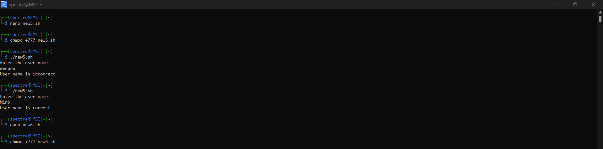
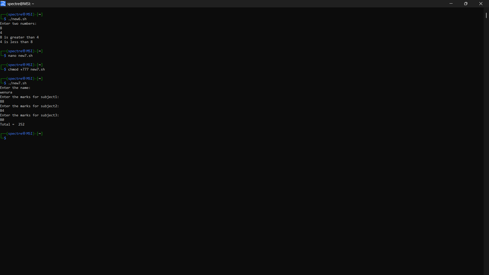

# Operating System Course - Day 05

> 📚 A comprehensive collection of daily practical lessons for Operating System course focusing on Windows batch scripting.

## 📋 Course Overview

This repository contains practical exercises and implementations for the Operating System course. Each lesson is organized with batch scripts and their corresponding outputs.

## 🗓️ Day 05 Content

### 🎯 Script Overview

This lesson demonstrates three essential batch scripts for system operations and information display:

### 📊 Script Implementations

| Script | Purpose | Output |
|--------|---------|--------|
| Main Script | Demonstrates core batch scripting concepts and command execution |  |
| System Details | Displays comprehensive system information and configurations |  |
| OS Commands | Shows various OS-level operations and command usage |  |

### 🔍 Technical Details

- **Script 1 (Main Script)**: Demonstrates fundamental batch commands, file operations, and control structures
- **Script 2 (System Details)**: Retrieves and displays system information using built-in Windows commands
- **Script 3 (OS Commands)**: Showcases various operating system operations and administrative tasks

Each script output is captured and displayed above, showing the actual execution results and command responses.

### 📝 Linux Commands Overview

#### File Viewing Commands
- `nano program1.csv`: Opens the CSV file in the nano text editor for viewing and editing
- `more program1.csv`: Displays file content one screen at a time
- `less program1.csv`: Similar to more but allows backward movement
- `head -5 pqr.csv`: Shows first 5 lines of the file
- `tail -3 pqr.csv`: Shows last 3 lines of the file

#### Data Filtering and Processing
- `grep 'Engineering' pqr.csv`: Searches for lines containing 'Engineering'
- `awk -F, '{print NF;exit}'`: Prints number of fields in CSV using comma delimiter
- `awk -F, '{print $3}'`: Extracts third column from CSV
- `cut -d, -f4`: Extracts fourth column using comma delimiter
- `awk -F, '{print $2 "," $3}'`: Combines second and third columns

#### Sorting Operations
- `sort -t',' -k4,4n`: Sorts numerically by fourth column
- `sort -t',' -k3,3nr`: Sorts numerically by third column in reverse
- `sort -t',' -k4,4 -r`: Sorts by fourth column in reverse
- `sort -t',' -k2,2 | sort -t',' -k4,4 -r`: Complex sort by multiple columns

---

📖 **Learning Path** | 🛠️ **Practical Examples** | 📊 **Visual Outputs**

